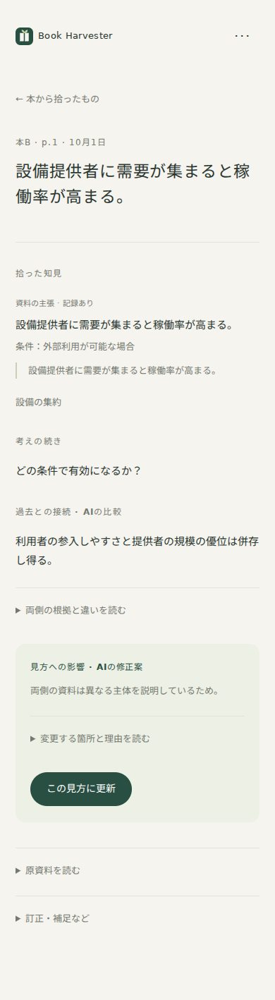
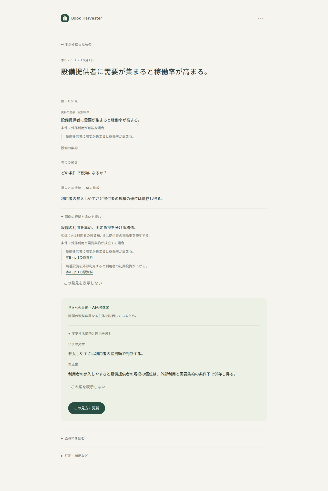

# #2 自動知見グラフの仕様検証

2026-10-01。#1のHarvest契約をそのまま入力に使い、Cloudflare D1・Queuesの既存構成へ追加した。**AI応答は合成したモック。実APIの精度を検証した結果ではない。**

## 確認できたこと

| 確認 | 結果 |
|---|---|
| TypeScript | 成功 |
| 統合・契約テスト | 合計23件成功（#1の11件＋#2の12件） |
| Cloudflare dry run | 成功 |
| workerdのローカルD1への追加マイグレーション | 26 SQL命令、成功 |
| Chromium 390×844 / 1280×900 | 写真保存の既存経路＋文章A/音声B→横断比較→部分修正採用→履歴を確認 |
| UI | 各画面の強調主操作は最大1件、新規トップレベルタブなし、横スクロール・JavaScript例外なし |

架空の短文A「共通設備を外部利用すると利用者の初期投資が下がる」、B「設備提供者に需要が集まると稼働率が高まる」を使った。両側の記録・引用へのリンク、共通構造、利用者と提供者という相違を表示。「参入しやすさと規模の優位が条件付きで併存する」というAIの類推を、外部検証済みの因果として扱わない。

採用前には本人の見方が変わらない。採用後は指定の箇所だけ変わり、「景気の見方は変えない」という別段落と、本人が後から書いた条件が保持される。新旧文章・理由・両側の根拠をViewRevisionへ残す。根拠資料を削除した場合も本人の文章と履歴を維持し、根拠の変更を表示する。

## 追加テストの範囲

- 全件承認なしでClaim・Concept・Question・Relationが保存され、検索とエクスポートへ含まれる。
- 同名「資本」の金銭と社会的関係を別概念にする応答を保存できる。語が違う同じ意味の概念の再利用には理由と別名を保存する。
- 無関係な資料の応答は横断発見0件で保存できる。
- 引用の捏造、存在しない参照ID、不適切な端点の型、根拠・条件不足の因果関係、方向が途切れる連鎖を拒否する。引用と意味の整合のすべてを決定的コードで証明するものではない。
- メカニズムの構成主張・関係を正規化IDへ変換し、条件・時間差とともに保存する。
- 古いView版への提案は採用できず、現行版へ再比較する。手動編集を上書きしない。
- 原資料訂正後は古い横断接続をすぐ非表示にする。処理中に出典版が変わった結果はコミットしない。
- 原資料削除後の再構成で記録を復活させない。採用済みの文章・履歴を旧スキーマから移行して維持する。
- 再構成失敗時は現行の有効世代を維持。重複メッセージでは追加世代を作らない。
- 非表示の接続は、文面や生成時の関係ID、根拠の列挙順が変わっても再表示しない。端点・方向・型・解釈・条件・引用で識別する。条件や引用が変わった接続は再表示される。架空キーで他の接続を非表示にできない。
- 横断ジョブのQueue送信失敗はoutboxから回復する。原資料とHarvestの成功を取り消さない。

意味の正しい生成や候補検索の精度はモックで証明できない。上記は、想定出力を安全に扱うアプリの保存・参照・更新・画面経路の検証である。

## 画面

合成資料・合成AI応答。ユーザーの読書内容は含まない。

## 残件と制限

実際のOpenAIキーとCloudflareアカウント認証が未提供のため、実APIでの写真・音声・横断意味判断、費用・遅延、リモート公開は未確認。スマホ実機、実データ規模での検索、バックアップ復元も未確認。Issue #1・#2は閉じない。

候補は直近8記録＋SQLで一致した過去4記録、合計最大12記録・120ノード、View6件。異なる語彙の構造はその候補内で比較する。全履歴から意味を拾うベクトル検索、外部調査、グラフ操作UIは含めない。接続の非表示は同じ根拠付き関係の言い換えを抑制する範囲。条件そのものの言い換え、別の端点や引用を使った同趣旨の接続、修正案の言い換えの抑制は今後の評価対象。

この文書は#2時点の確認記録。後続指示で#3〜#7のWeb拡張を実装した。現在の候補検索・画面・残件は[追加機能の検証記録](web-expansions-verification.md)を参照。

原資料削除後も、本人が採用した短い引用スナップショットは本人の見方の履歴に保持する。現行の原資料として表示せず、削除されたことを示す。
