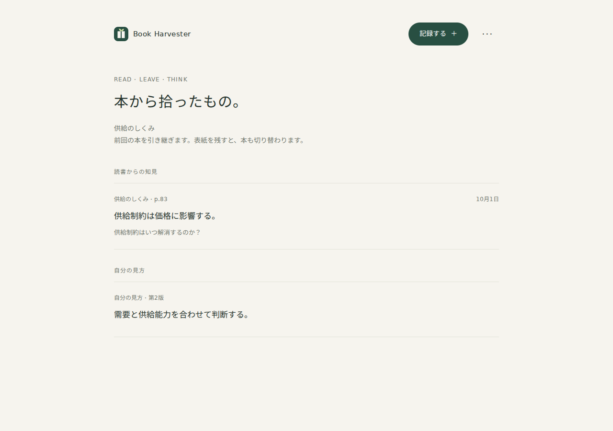
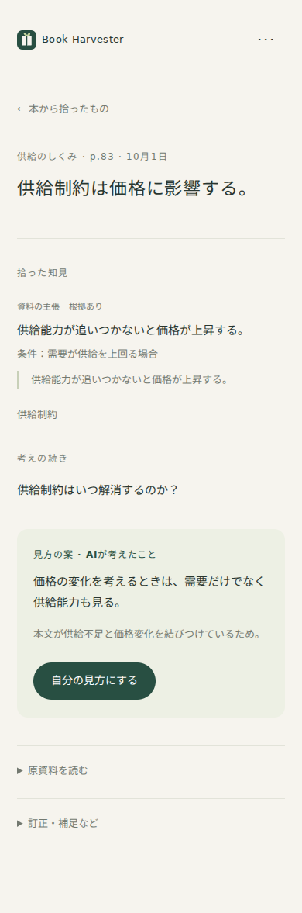

# #1 初期検証版の確認結果

2026-10-01。AI応答は合成したテスト資料・応答を使用。実際の書籍や本人の読書記録ではない。

## 実装した順序

1. 認証と原資料保存。書名・ページ入力を要求せず、保存失敗時は入力を画面に残す。
2. 保存と同じD1バッチに永続ジョブを登録。R2先行保存とキュー登録失敗からの復旧を実装。
3. 画像のResponses API、音声のAudio APIを分け、構造化結果を共通契約にする。
4. 知見・概念・問いを自動保存し、後で読む画面を実装。
5. AIの見方を本人が採用し、根拠スナップショット・改訂・復元を残す。
6. 訂正・補足・短い質問・検索・書き出し・削除を詳細と一つのメニューに統合。

## 自動検証

| 確認 | 結果 |
|---|---|
| `npm run check` | TypeScriptの型確認成功。EnvはWranglerで生成 |
| `npm test` | 11件成功 |
| `npm run build` | Cloudflare向けWorkerと静的資産のdry run成功。公開はしていない |
| `npm run test:browser` | Chromiumで390px/1280pxの画面と主要操作を確認 |

統合テストは実際のWorkerコードとSQLiteのD1アダプターを呼ぶ。写真→永続ジョブ→ブラウザのログアウト→解析完了→再ログイン→採用→編集→復元→原資料付きエクスポートを検証した。

音声はmultipartのAudio API文字起こし、その後のResponses API＋strictなJSON Schemaへ接続する契約を確認。二重送信、異なる内容での同じキー利用、古い版の編集、訂正中に完了した古いAI応答、解析前の本人Viewの不在、出典のない引用、未知の主張IDを検証した。

AIキー未設定・API拒否でも原資料を保持する。Queue送信失敗はD1 outboxから再送される。日次API上限、未認証のAPI/原画像/エクスポート拒否、別オリジンの変更拒否、偽装画像の拒否、明示削除の原ファイル・AI知識削除も確認した。#2の追加で、本人が採用した見方・履歴は原資料削除後も保持し、根拠の変更を表示する仕様へ更新した。

## Cloudflareローカルランタイム

Wrangler/workerdでD1マイグレーション、ログイン200、写真の保存201、R2原画像の認証済み取得200、未認証取得401、原ファイル付きJSONエクスポートを確認。AIキーがない状態のQueue処理は`blocked / ai_not_configured`となり、解析成功を装わない。

この実行環境ではOSのネットワークインターフェース列挙が制限されているため、検証用プロセスだけloopbackを使用する一時的な補助設定を使った。アプリやWranglerのソースには変更を加えていない。

## UI

ブラウザでログイン→写真選択→自動保存→ページを再読み込み→知見→採用→見方の編集を操作した。通常の記録経路で書名・ページ・概念・タグ・解析開始・承認の入力はゼロ。写真を選んだ後に保存ボタンを押す必要もない。

390pxと1280pxで、ホームの強調操作が1つ、記録ダイアログが1つ、未採用の知見詳細が1つであることを確認した。横スクロール・JavaScriptの実行エラーはない。マイクを利用できない場合も音声ファイル入力へ戻れる。

以下は合成した解析結果を使った画面例。

## 未確認・残件

- **OpenAIの実呼び出し**：この環境にAPIキーがないため、実写真の読解精度、実音声の文字起こし精度、実際の料金・応答時間は未確認。モックの成功を実APIの成功として扱わない。
- **本番Cloudflare**：WranglerにCloudflareアカウントの認証がなく、実際のD1 ID・公開先URL・秘密も未設定。リモート資源の作成、マイグレーション、デプロイは未実施。
- **スマホ実機**：iPhone/Androidでのカメラ選択・録音・画面ロック時の挙動は未確認。ブラウザの幅確認とは分ける。
- **バックアップ復元**：エクスポートとバックアップ手順は用意したが、本番のD1/R2一式を復元する運用実演は未実施。
- **#2**：[横断グラフの実装と追加検証](graph-verification.md)を追加済み。実APIでの意味判断の評価は未確認。

これらが残るため#1は開いたままにする。
